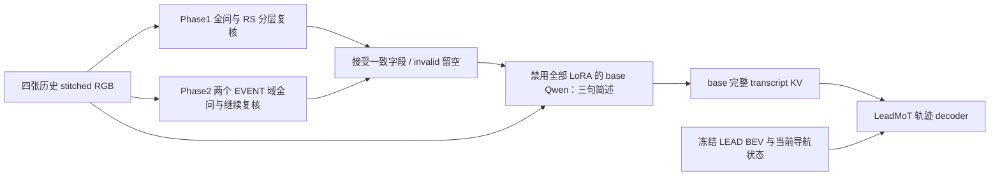

# Action prior 轨迹训练

从远端 `AutoMoT/` 目录运行。入口是 `run_full_pipeline.sh`；Phase3 仍在训练时不加载它。

## 本路线实际训练什么

冻结本地 `Qwen3-VL-4B-Instruct`、Phase1/2 LoRA 和 LEAD BEV encoder，只训练已有 LeadMoT
轨迹 decoder。这里的 **base** 指 Instruct 基座禁用全部 LoRA，不是另一个非 Instruct checkpoint。
输出仍为 `route (B,10,2)`、`future_waypoints (B,8,2)`；head 是 **Linear+cumsum**，不是扩散模型。
坐标、BEV 预处理、导航状态、轨迹 loss 沿用 `leadmot/`，只更换语言条件。



新 Phase1 已融合四问事实和 RS。每帧先随机全问 8 项，再分别用四个已训练的
hierarchical spec 复核 RS1/2/4/5，每次保留事实四问；也检查 GROUP 与完整 RS 向量的相容性。
`HIGHWAY` 和 `RS_HIGHWAY` 是独立标签，不强制相等。完整 RS 四问全 NO 才恢复 R3，不能由 R3 推出高速。

新 Phase2 **没有训练过 hierarchical GROUP/DETAIL**。这里先随机遍历两种正式问题域，
再接着各自 assistant 回答，用同域的另一随机顺序继续全问，比较同一字段。
不添加未训练的 EVENT 类别/格式，也不把 RS 结果写成 EVENT 模型已知的上一轮 RS。
两个域都问，避免 RS 门控漏掉路口 interrupted overlay 上的 UE3。
这属于“域内复核”，不宣称是新增的 EVENT 分层模型；两次一致也不等于真实标注正确。

单帧首次需要 5 次 Phase1、4 次 Phase2 问答和一次 base 简述，然后 base 完整 prefill。
每个 adapter 按自身配置选择 `4rgb=[0,1,2,3]` 或 `2rgb_endpoints=[0,3]`；最终 base 固定吃四张图。
复核是真实多轮对话，完整重做图文 prefill；不同模型/adapter 之间绝不传递 KV。
base 简述固定 Scene / Interaction / Planning context 三个短段，每段最多 25 词。
截断或段落格式失败时使用三句保守模板，并记 `analysis_fallback`；语义忠实程度仍需看 probe。
简述 prompt 只接收已接受条件、语义释义和当前导航，不接 GT event、未来位置或 Phase3 动作。

## 权重选择

必须有完整模型权重，只有 audit bundle 不够。默认递归搜索 `checkpoints/` 内的
`best_generation/sft_new_loop_phase{1,2}_adapter_config.json`，并要求实际 adapter 权重存在。

- 自动只接受目录名精确为 `best_generation`；**没有 final / fallback_generation / best_generation_balanced 兜底**。
- 校验当前生产 prompt name/hash、训练 Git commit、base 路径、RGB mode/count/indices。
- Phase1 用 adapter 的 global_step 精确回查同 run 的 `train_eval_metrics.jsonl` generation 记录和 format gate。
- Phase2 读取同 run 的 `best_generation.json`，核验 step 和 guards。
- 多个兼容 run 按其已记录的 validation generation exact 降序，平分按保存时间、路径确定顺序。
  不同 run 可能评了不同样本，这只是自动选择策略，不能称为共同 holdout 上的严格排名。
- 显式 `PHASE1_ADAPTER` / `PHASE2_ADAPTER` 可选其它 checkpoint，但仍硬校验合同，并记录为 explicit；不会冒称 best。
- `selected_priors.json` 保存来源、版本、Git、选择分数、拒绝原因、实际权重 SHA256。
  checkpoint 内再次保存合同，旧 LeadMoT/eval_carla 会拒绝其新 schema；请使用本目录 eval。

base、processor/tokenizer 文件、BEV、两个 adapter 和本子包 Python 代码均参与指纹。
旧 prompt 权重必须用对应代码环境或重训，不能篡改 metadata hash 来绕过。
模型迁移时保留 adapter 配置中 base 路径的等价软链接；当前实现严格按 resolve 后路径检查。

先只核验模型，不构建数据、不加载 GPU 模型：

```bash
ACTION_MODE=preflight bash qwen3vl_local/action_prior/train.sh --models-only
```

指定权重：

```bash
PHASE1_ADAPTER=checkpoints/phase1_run/best_generation \
PHASE2_ADAPTER=checkpoints/phase2_run/best_generation \
ACTION_MODE=preflight bash qwen3vl_local/action_prior/train.sh --models-only
```

本地 BEV 默认 `checkpoints/tfv6_resnet34/model_0030_0_backbone_only.pth`，可用 `LEAD_BEV_CKPT` 覆盖。
新入口禁用旧 backbone 构造中的 ImageNet 下载，随后 strict 加载 LEAD backbone，不接受随机 BEV。
所有 HF 模型加载都离线。不会安装依赖或下载模型。

## 全量训练

```bash
bash qwen3vl_local/action_prior/run_full_pipeline.sh
# 同一四卡命令的显式选卡示例
GPU_IDS=0,1,2,3 bash qwen3vl_local/action_prior/run_full_pipeline.sh
```

默认请求四张 GPU，自动按显存占用/利用率选择；仍请在自己的训练资源范围内运行。
`GPU_IDS` 非空时卡数由它决定；`DDP_GPU_COUNT=N` 只改变自动请求卡数。
脚本先核验模型，再建全量索引，训练后用 `best.pt` 的 EMA 跑全量 test，并生成 24 个 probe case。

| 默认设置 | 值与口径 |
|---|---|
| 数据 | 所有合法 anchor，stride=1，4Hz；不做 scenario 下采样 |
| 划分 | 哈希约 80/10/10 train/val/test，按 scenario+Town+物理 route；Rep/时间戳不跨 split |
| 异常 route | 构建与实际读取前都排除 >90s，唯一白名单 BlockedIntersection/ControlLoss |
| 输入窗口 | 四帧连续 RGB，首帧 left-pad；沿用旧 loader，尾部保留 +2s 文件可用性余量 |
| epoch | 61，每轮 shuffle 后无重复 DDP 分片；至多丢 world_size−1 个尾样本，下轮重新 shuffle |
| batch | 每 GPU 1 个 clip，累积 16；四卡有效 batch=64 |
| optimizer | AdamW，LR 2e-4，betas=(0.9,0.95)，weight_decay=.01，grad clip=1 |
| 调度 | 5% warmup + cosine；不随卡数自动放大 LR |
| 精度 | 默认 bf16；支持 fp32，拒绝没有 loss scaling 的 fp16 |
| loss | .5×(route L1 + route末点 L1) + waypoint L1，均对 ego 累计点 |
| 验证 | 每 250 optimizer steps 固定 256 val 帧；每完整 epoch 全量 val |
| 选优 | `best.pt` 按 epoch 全量 val 的 EMA loss；周期小验证仅观察趋势 |
| 保存 | 每 1000 optimizer steps 和 epoch 结束原子保存 latest.pt，保留 best.pt |
| 日志 | 每 10 optimizer steps 全 rank 汇总均值；TB loss、ADE/FDE、LR、梯度、invalid、缓存命中 |

61 epoch / base LR 2e-4 / batch 64 的参考是 `lead/lead/training/config_training.py`；
当前冻结 Qwen + 独立 decoder 的 loss、优化器 betas 和 warmup 参考已有 `leadmot/train.py`。
这是有来源的起始配置，**尚未经过这条新 KV 分布下的学习率实验验证**。
不直接照搬 LEAD 随 GPU 数量 sqrt 放大 LR，保持本路线默认 batch64 下的 LR2e-4。

`training_plan.json` 会给出实际训练帧数 N、每 rank 样本数、每轮/总 optimizer steps、总呈现次数和 DDP 尾部数。
四卡时每轮更新数为 `ceil(floor(N/4)/16)`。不能用旧 SFT 的 147456 balanced cases 代替 action 的实际全量 N。
例如 N=800000，四卡每轮 12500 更新，61 轮 762500 更新、4880 万帧呈现；这只是算例，不是已扫描数据量。

缓存默认开启：冻结问答与简述是确定性的，结果按合同、四张 RGB 字节、导航、sample seed 缓存在
`text_cache/rankN.sqlite`。只保存压缩文本/原始回答/计数和 prompt hash；不缓存图片或 GPU KV。
首次和命中都用 base 重建相同完整 transcript，训练条件不变。
不同 rank 的缓存独立，epoch 重新分片时一帧可能在多个 rank 分别产生首次计算。
`--no-cache-priors` 可关闭。即使命中，invalid 仍按本轮实际训练呈现次数重新计数。
缓存可能较大，和所有训练产物一样只放 checkpoints，不入库；更换权重/图像/导航/代码后自动不命中。

先单卡 smoke：

```bash
DATA_DIR=checkpoints/action_prior_data/已有索引目录 bash qwen3vl_local/action_prior/smoke.sh
GPU_IDS=0 DATA_DIR=checkpoints/action_prior_data/已有索引目录 bash qwen3vl_local/action_prior/smoke.sh
```

smoke 仅 4 个 optimizer steps、每 2 步验证 4 帧，**不是正式全量训练**。
先看首轮吞吐、峰值显存、invalid/analysis_fallback 与轨迹输出，再安排长训练。
Phase3 正在跑时用 GPU_IDS 指定预留卡，避免自动选择仍有其它任务的卡。

复用已有全量索引，调训练参数：

```bash
DATA_DIR=checkpoints/action_prior_data/已有索引目录 \
NUM_EPOCHS=61 LR=0.0002 GRAD_ACCUM=16 \
bash qwen3vl_local/action_prior/train.sh
GPU_IDS=0,1,2,3 DATA_DIR=checkpoints/action_prior_data/已有索引目录 \
NUM_EPOCHS=61 LR=0.0002 GRAD_ACCUM=16 \
bash qwen3vl_local/action_prior/train.sh
```

所有 CLI 参数见 `python qwen3vl_local/action_prior/train.py --help`。
CLI 位于 shell 默认参数后，可覆盖；输出目录必须用 OUTPUT_DIR 环境变量。
`run_<RUN_TAG>` 默认时间戳，base 层维护 latest symlink，重复 run tag 拒绝覆盖。
`NO_RUN_SUBDIR=1` 仅对尚不存在的顶层目录运行，不覆盖已有实验。

断点恢复自动读取原 run 的 config/plan/selected_priors，恢复原索引、权重与超参数：

```bash
bash qwen3vl_local/action_prior/resume.sh checkpoints/action_prior/run_时间戳/latest.pt
GPU_IDS=0,1,2,3 bash qwen3vl_local/action_prior/resume.sh checkpoints/action_prior/run_时间戳/latest.pt
```

默认自动请求原 world size，显式 GPU_IDS 的数量必须保持一致。
也可 `RESUME=... bash qwen3vl_local/action_prior/run_full_pipeline.sh`，恢复完成后继续最终 eval/probe。
checkpoint 保存 optimizer/scheduler/EMA、各 rank RNG、下一 epoch/micro cursor 和数据 SHA。
未完成 epoch 的各 rank invalid/损失累积计数一起恢复；若在 epoch 验证中退出，恢复后先补验证和 best 选择。
改变 world size、索引、调度或语言条件会拒绝 resume；坏样本/非有限 loss 直接失败，绝不静默“跳过训练成功”。
累积窗口最后不足 16 帧时按实际帧数归一化并更新，不丢最后一组。

## 测试、审计与 TensorBoard

```bash
bash qwen3vl_local/action_prior/eval.sh --checkpoint checkpoints/action_prior/latest/best.pt
GPU_IDS=0 bash qwen3vl_local/action_prior/eval.sh --checkpoint checkpoints/action_prior/latest/best.pt
bash qwen3vl_local/action_prior/probe.sh --checkpoint checkpoints/action_prior/latest/best.pt
GPU_IDS=0 bash qwen3vl_local/action_prior/probe.sh --checkpoint checkpoints/action_prior/latest/best.pt
bash qwen3vl_local/tb_serve.sh checkpoints/action_prior/latest/tb
bash qwen3vl_local/action_prior/test.sh
```

`eval.sh` 默认全量 test、EMA；`--split val` / `--max-samples N` / `--raw` 可覆盖。
`probe.sh` 默认随机固定 seed 24 case，保存 JSON 原始问答、invalid 原因、base 简述、预测/GT 点。
probe 后会自动将 JSON 绘制为 BEV 风格轨迹对比 PNG（无地图），便于检查坐标与轨迹形状。

invalid 字段细分 `format/disagreement/group_format/group_disagreement/multiple_rs_yes`、
`domain_inapplicable/domain_unconfirmed`。每个字段和原因单独计数；还报告 `unconfirmed_samples`，
以区别本就不适用的另一个 EVENT 域和实际的复核失败。
每帧两个 EVENT 域都问，所以总 invalid 样本比例可能很高，不能把它直接解释成模型错误率。
`epoch_audit/` 是全 rank 实际呈现计数；`audit/` 每个 rank/epoch 按 invalid 原因组合保留至多20例，
accepted 组合保留4例。缓存命中样本保留原始回答与 prompt 指纹，首次 miss 的 dump 含完整 prompt。

## 参考与验证边界

[AutoVLA 官方代码](https://github.com/ucla-mobility/AutoVLA) 把语言推理和离散动作 token 统一自回归生成；
其 [CoT annotation prompt](https://github.com/ucla-mobility/AutoVLA/blob/main/dataset_utils/preprocessing/cot_prompts.py)
用场景、关键对象、意图、动作组织输出，annotation 还带未来动作 GT。
本实现借鉴简短场景/交互/规划上下文的组织方式，没有引入其未来动作 GT、离散 codebook、GRPO 或替换现有轨迹 head。

本地验证覆盖 CPU 合同/小模型代数、轨迹 head backward，以及真实训练循环的中断恢复（decoder/EMA 与连续训练逐项一致）。
CPU 循环测试替换模型、数据 IO 和 TensorBoard writer，不代表已验证实际 GPU 或日志服务。
真实 Qwen3-VL、完整 BEV 权重、
多 GPU DDP、全量数据训练与闭环成绩必须在有对应资源的远端运行 smoke/训练确认。
当前不把这条新 checkpoint 接入旧 eval_carla，也没有接 Phase3。
