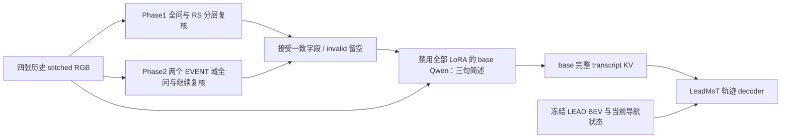

# Action prior 轨迹训练

从远端 `AutoMoT/` 目录运行。入口是 `run_full_pipeline.sh`；Phase3 仍在训练时不加载它。

## 本路线实际训练什么

冻结本地 `Qwen3-VL-4B-Instruct`、Phase1/2 LoRA 和 LEAD BEV encoder，只训练已有 LeadMoT
轨迹 decoder。这里的 **base** 指 Instruct 基座禁用全部 LoRA，不是另一个非 Instruct checkpoint。
输出仍为 `route (B,10,2)`、`future_waypoints (B,8,2)`；head 是 **Linear+cumsum**，不是扩散模型。
坐标、BEV 预处理、导航状态、轨迹 loss 沿用 `leadmot/`，只更换语言条件。



新 Phase1 已融合四问事实和 RS。每帧先随机全问 8 项，再分别用四个已训练的
hierarchical spec 复核 RS1/2/4/5，每次保留事实四问；也检查 GROUP 与完整 RS 向量的相容性。
`HIGHWAY` 和 `RS_HIGHWAY` 是独立标签，不强制相等。完整 RS 四问全 NO 才恢复 R3，不能由 R3 推出高速。

新 Phase2 **没有训练过 hierarchical GROUP/DETAIL**。这里先随机遍历两种正式问题域，
再接着各自 assistant 回答，用同域的另一随机顺序继续全问，比较同一字段。
不添加未训练的 EVENT 类别/格式，也不把 RS 结果写成 EVENT 模型已知的上一轮 RS。
两个域都问，避免 RS 门控漏掉路口 interrupted overlay 上的 UE3。
这属于“域内复核”，不宣称是新增的 EVENT 分层模型；两次一致也不等于真实标注正确。

默认单帧首次需要5次 Phase1、4次 Phase2 问答、一次 base 简述和最多一次纯文本简述复核，然后 base 完整 prefill。
每个 adapter 按自身配置选择 `4rgb=[0,1,2,3]` 或 `2rgb_endpoints=[0,3]`；最终 base 固定吃四张图。
复核是真实多轮对话，完整重做图文 prefill；不同模型/adapter 之间绝不传递 KV。
base 使用自己的措辞生成 Scene / Interaction / Planning context 三个短段，每段最多60词。
输入仅有四图、接受的条件及其语义释义和当前导航；**没有 VERIFIED_SUMMARY 或预制分析答案**。
要求描述已知道路结构、覆盖正类事实/交互，负类可合并或省略但不能反转，null 不当 NO。
Planning context 必须结合本帧实际速度、导航几何和事件条件，不能总写“使用当前导航”。不接 GT event、未来位置或 Phase3 动作。

生成后，在禁用全部 LoRA 的同一基座上新开一次纯文本 prefill，独立复核五项：先验一致性/道路结构覆盖、
正类覆盖、未知字段、无额外断言、导航依据。复核不继承生成 KV，也不重新从 RGB 判断先验。
JSON 缺键、额外键、重复键、非布尔、截断或任一项 false 均不能接受。通过后保留生成原文，不归一成模板。
**这是模型判定，不是语义保证**：同一基座可能在两次调用中重复误解，同源误判需用真实 RGB/人工标签审计。
复核只能检查给定先验与导航，不能证明额外图像细节；`summary_model_accepted` 不应被称为人工验证正确。

生成/复核失败才用完整保守 fallback，保留 Phase1 静态障碍/弱势参与者/异常信号与其余字段。
fallback 的 planning 段也根据可解析的当前速度、目标方位及正类条件变化，但不冒充模型生成。
日志保存 `raw_analysis`、`analysis_review_raw`、逐项布尔和失败原因；缓存将判定绑定对应草稿 SHA。
命中时只检查已存判定与草稿配对，最终仍完整重建 base KV，复核文本和失败草稿不进入最终 transcript。

## 权重选择

必须有完整模型权重，只有 audit bundle 不够。默认递归搜索 `checkpoints/` 内的
`best_generation/sft_new_loop_phase{1,2}_adapter_config.json`，并要求实际 adapter 权重存在。

- 自动只接受目录名精确为 `best_generation`；**没有 final / fallback_generation / best_generation_balanced 兜底**。
- 校验当前生产 prompt name/hash、训练 Git commit、base 路径、RGB mode/count/indices。
- Phase1 用 adapter 的 global_step 精确回查同 run 的 `train_eval_metrics.jsonl` generation 记录和 format gate。
- Phase2 读取同 run 的 `best_generation.json`，核验 step 和 guards。
- 多个兼容 run 按其已记录的 validation generation exact 降序，平分按保存时间、路径确定顺序。
  不同 run 可能评了不同样本，这只是自动选择策略，不能称为共同 holdout 上的严格排名。
- 显式 `PHASE1_ADAPTER` / `PHASE2_ADAPTER` 可选其它 checkpoint，但仍硬校验合同，并记录为 explicit；不会冒称 best。
- `selected_priors.json` 保存来源、版本、Git、选择分数、拒绝原因、实际权重 SHA256。
  checkpoint 内再次保存合同，旧 LeadMoT/eval_carla 会拒绝其新 schema；请使用本目录 eval。

base、processor/tokenizer 文件、BEV、两个 adapter 均参与指纹。
执行指纹使用 `provenance.EXECUTION_SEEDS` 声明真实 action/延迟入口，展开模块初始化时的本地 import 和 package initializer。
当前核对48个源码文件，含共享 engine/M-RoPE/LeadMoT、实际 prompt 依赖、只读 runner 和其 BEV 工具；
**不含 sft_new_loop_phase3**。不会递归扫描整个 qwen3vl_local，也不追踪未调用 CLI/GoalGen 分支。
修改真实依赖会失效，修改未接入的 Phase3 不影响恢复；新增延迟执行路径时必须同步 seeds。
参考源码只读哈希，不入库。依赖包版本也记录；Git 用于溯源，不把 commit 字段存在当环境兼容证明。
驱动/硬件差异仍需实际数值验证。

旧 prompt 权重必须用对应代码环境或重训，不能篡改 metadata hash 来绕过。
模型迁移时保留 adapter 配置中 base 路径的等价软链接；当前实现严格按 resolve 后路径检查。

先只核验模型，不构建数据、不加载 GPU 模型：

```bash
ACTION_MODE=preflight bash qwen3vl_local/action_prior/train.sh --models-only
```

指定权重：

```bash
PHASE1_ADAPTER=checkpoints/phase1_run/best_generation \
PHASE2_ADAPTER=checkpoints/phase2_run/best_generation \
ACTION_MODE=preflight bash qwen3vl_local/action_prior/train.sh --models-only
```

本地 BEV 默认 `checkpoints/tfv6_resnet34/model_0030_0_backbone_only.pth`，可用 `LEAD_BEV_CKPT` 覆盖。
新入口禁用旧 backbone 构造中的 ImageNet 下载，随后 strict 加载 LEAD backbone，不接受随机 BEV。
所有 HF 模型加载都离线。不会安装依赖或下载模型。

## 全量训练

```bash
bash qwen3vl_local/action_prior/run_full_pipeline.sh
# 同一四卡命令的显式选卡示例
GPU_IDS=0,1,2,3 bash qwen3vl_local/action_prior/run_full_pipeline.sh
```

默认请求四张 GPU，自动按显存占用/利用率选择；仍请在自己的训练资源范围内运行。
`GPU_IDS` 非空时卡数由它决定；`DDP_GPU_COUNT=N` 只改变自动请求卡数。
脚本先核验模型，再建全量索引，训练后用 `best.pt` 的 EMA 跑全量 test，并生成 24 个 probe case。

| 默认设置 | 值与口径 |
|---|---|
| 数据 | 所有合法 anchor，stride=1，4Hz；不做 scenario 下采样 |
| 划分 | 哈希约 80/10/10 train/val/test，按 scenario+Town+物理 route；Rep/时间戳不跨 split |
| 异常 route | 构建与实际读取前都排除 >90s，唯一白名单 BlockedIntersection/ControlLoss |
| 输入窗口 | 四帧连续 RGB，首帧 left-pad；沿用旧 loader，尾部保留 +2s 文件可用性余量 |
| epoch | 61，每轮 shuffle 后无重复 DDP 分片；至多丢 world_size−1 个尾样本，下轮重新 shuffle |
| batch | 每 GPU 1 个 clip，累积 16；四卡有效 batch=64 |
| optimizer | AdamW，LR 2e-4，betas=(0.9,0.95)，weight_decay=.01，grad clip=1 |
| 调度 | 5% warmup + cosine；不随卡数自动放大 LR |
| 精度 | decoder 参数、梯度、AdamW 状态和 EMA 为 FP32；默认仅 decoder 前向 BF16 autocast，轨迹 loss FP32；冻结 Qwen 单独按 qwen_dtype |
| loss | .5×(route L1 + route末点 L1) + waypoint L1，均对 ego 累计点 |
| 验证 | 每 250 optimizer steps 固定 256 val 帧；每完整 epoch 全量 val |
| 选优 | `best.pt` 按 epoch 全量 val 的 EMA loss；周期小验证仅观察趋势 |
| 保存 | 每 1000 optimizer steps 和 epoch 结束原子保存 latest.pt，保留 best.pt |
| 日志 | 每 10 optimizer steps 全 rank 汇总均值；TB loss、ADE/FDE、LR、梯度、invalid、缓存命中 |

61 epoch / base LR 2e-4 / batch 64 的参考是 `lead/lead/training/config_training.py`；
当前冻结 Qwen + 独立 decoder 的 loss、优化器 betas 和 warmup 参考已有 `leadmot/train.py`。
这是有来源的起始配置，**尚未经过这条新 KV 分布下的学习率实验验证**。
不直接照搬 LEAD 随 GPU 数量 sqrt 放大 LR，保持本路线默认 batch64 下的 LR2e-4。

`training_plan.json` 会给出实际训练帧数 N、每 rank 样本数、每轮/总 optimizer steps、总呈现次数和 DDP 尾部数。
四卡时每轮更新数为 `ceil(floor(N/4)/16)`。不能用旧 SFT 的 147456 balanced cases 代替 action 的实际全量 N。
例如 N=800000，四卡每轮 12500 更新，61 轮 762500 更新、4880 万帧呈现；这只是算例，不是已扫描数据量。

缓存默认开启：冻结问答与简述按完整执行合同、四张 RGB 字节、导航和 sample seed 缓存在
`text_cache/shared_v2/<bucket>/<hash>.json.z`。各 rank 共用原子文本文件，4096 个桶的 POSIX 锁在 miss 后二次检查，
同帧跨卡不再各生成一次；生成进程异常退出会释放锁，完整结果原子发布。要求所有 rank 看到同一支持
POSIX 文件锁与原子 rename 的目录；默认面向单机多卡，不使用 NFS 多写者 SQLite/WAL。
只保存压缩文本/原始回答/计数和 prompt hash，不缓存图片或 GPU KV。每次最终 base 完整 prefill 保持不变。
`--no-cache-priors` 可关闭；缓存命中仍按每次呈现计数。旧 rankN.sqlite 不复用、不自动删除。
更换权重/图像/导航/执行合同会产生新 key；依然需要磁盘容量预算，不入库。
`training_plan.json` 同时报冷生成次数：history/independent 每个唯一帧最多11次，compare最多17次，base0次（含新增的纯文本简述复核）；
所有模式每次呈现仍需一次最终 prefill。先测冷缓存/缓存命中吞吐，再决定61轮预算，不能从 LEAD 的 epoch 数推断耗时。

先单卡 smoke：

```bash
DATA_DIR=checkpoints/action_prior_data/已有索引目录 bash qwen3vl_local/action_prior/smoke.sh
GPU_IDS=0 DATA_DIR=checkpoints/action_prior_data/已有索引目录 bash qwen3vl_local/action_prior/smoke.sh
```

smoke 仅 4 个 optimizer steps、每 2 步验证 4 帧，**不是正式全量训练**。
先看首轮吞吐、峰值显存、invalid/analysis_fallback 与轨迹输出，再安排长训练。
Phase3 正在跑时用 GPU_IDS 指定预留卡，避免自动选择仍有其它任务的卡。

复用已有全量索引，调训练参数：

```bash
DATA_DIR=checkpoints/action_prior_data/已有索引目录 \
NUM_EPOCHS=61 LR=0.0002 GRAD_ACCUM=16 \
bash qwen3vl_local/action_prior/train.sh
GPU_IDS=0,1,2,3 DATA_DIR=checkpoints/action_prior_data/已有索引目录 \
NUM_EPOCHS=61 LR=0.0002 GRAD_ACCUM=16 \
bash qwen3vl_local/action_prior/train.sh
```

所有 CLI 参数见 `python qwen3vl_local/action_prior/train.py --help`。
CLI 位于 shell 默认参数后，可覆盖；输出目录必须用 OUTPUT_DIR 环境变量。
`run_<RUN_TAG>` 默认时间戳，base 层维护 latest symlink，重复 run tag 拒绝覆盖。
`NO_RUN_SUBDIR=1` 仅对尚不存在的顶层目录运行，不覆盖已有实验。

断点恢复自动读取原 run 的 config/plan/selected_priors，恢复原索引、权重与超参数：

```bash
bash qwen3vl_local/action_prior/resume.sh checkpoints/action_prior/run_时间戳/latest.pt
GPU_IDS=0,1,2,3 bash qwen3vl_local/action_prior/resume.sh checkpoints/action_prior/run_时间戳/latest.pt
```

默认自动请求原 world size，显式 GPU_IDS 的数量必须保持一致。
也可 `RESUME=... bash qwen3vl_local/action_prior/run_full_pipeline.sh`，恢复完成后继续最终 eval/probe。
checkpoint 保存 optimizer/scheduler/EMA、各 rank RNG、下一 epoch/micro cursor 和数据 SHA。
未完成 epoch 的各 rank invalid/损失累积计数一起恢复；若在 epoch 验证中退出，恢复后先补验证和 best 选择。
FP32 checkpoint 容器仍为 v2；自然语言分析协议为 v3，旧照抄模板和旧 BF16 参数合同明确拒绝 resume/eval，不能靠改 metadata 绕过。
改变 world size、索引、调度或语言条件会拒绝 resume；坏样本/非有限 loss 直接失败，绝不静默“跳过训练成功”。
累积窗口最后不足 16 帧时按实际帧数归一化并更新，不丢最后一组。

## 测试、审计与 TensorBoard

```bash
bash qwen3vl_local/action_prior/eval.sh --checkpoint checkpoints/action_prior/latest/best.pt
GPU_IDS=0 bash qwen3vl_local/action_prior/eval.sh --checkpoint checkpoints/action_prior/latest/best.pt
bash qwen3vl_local/action_prior/probe.sh --checkpoint checkpoints/action_prior/latest/best.pt
GPU_IDS=0 bash qwen3vl_local/action_prior/probe.sh --checkpoint checkpoints/action_prior/latest/best.pt
bash qwen3vl_local/tb_serve.sh checkpoints/action_prior/latest/tb
bash qwen3vl_local/action_prior/test.sh
```

`eval.sh` 默认全量 test、EMA；`--split val` / `--max-samples N` / `--raw` 可覆盖。
`probe.sh` 默认随机固定 seed 24 case，保存 JSON 原始问答、invalid 原因、base 简述、预测/GT 点。
probe 后会自动将 JSON 绘制为 BEV 风格轨迹对比 PNG（无地图），便于检查坐标与轨迹形状。

invalid 字段细分 `format/disagreement/group_format/group_disagreement/multiple_rs_yes`、
`domain_inapplicable/domain_unconfirmed`。每个字段和原因单独计数；还报告 `unconfirmed_samples`，
以区别本就不适用的另一个 EVENT 域和实际的复核失败。
每帧两个 EVENT 域都问，所以总 invalid 样本比例可能很高，不能把它直接解释成模型错误率。
`epoch_audit/` 是全 rank 实际呈现计数；`audit/` 每个 rank/epoch 按 invalid 原因组合保留至多20例，
accepted 组合保留4例。缓存命中样本保留原始回答与 prompt 指纹，首次 miss 的 dump 含完整 prompt。

## 审查修订：复核、上游重叠与配对消融（2026-09-06）

`--recheck-mode history` 保持最初授权的带答案续问；`independent` 对 Phase1 分层和 Phase2 域内均重新单轮问答；
`compare` 同时执行两种，condition 仍由 history 接受，额外独立结果仅用于审计。
即使两分支不一致也不要求共识：输出显式记录 `condition_acceptance_policy=history_consistency`、
`compare_requires_consensus=false` 和跨模式分歧；这是观察工具，不是更严格的接受模式。复核次数/格式/分歧/接受字段/
`same_prompt` 按 scope 和模式写入 TB/JSON。UE6 单题域没有合法新排列，独立 greedy 重问同一 prompt
基本是重复计算，不是额外证据；带历史同样存在复制风险，一致率不是准确率。
不训练 action 即可做24帧真实模型对照，保留所有原始回答和简述拒绝原因：

```bash
DATA_DIR=checkpoints/action_prior_data/已有索引目录 bash qwen3vl_local/action_prior/audit_priors.sh
GPU_IDS=0 DATA_DIR=checkpoints/action_prior_data/已有索引目录 bash qwen3vl_local/action_prior/audit_priors.sh
```

该报告不计算 GT 筛错率；要判断谁筛出了错误，需对照实际 RGB/人工标签。本机未运行真实模型对照。

导航 `--target-point-lookahead-s`、`--next-target-point-lookahead-s`、`--tp-min-lookahead-m`
会覆盖旧索引同名值并传入实际 loader，训练/eval/resume 使用相同生效配置。
BEV 帧数/步长目前必须1，4Hz间隔必须0.25，route10/waypoint8固定；其它值在模型加载前报错，
不把尚未接通的多帧 BEV 当作可调实验参数。

所选 adapter 同 run 的 `train_run_manifest.json` 指向实际 SFT index；若路径迁移，可显式传
`--phase1-training-index` / `--phase2-training-index`（train、resume、eval/probe 都支持）。
生成兼容 identity 与审计 `audit_identity` 分开：索引路径、自动/显式来源、可用状态和内容只进入独立审计记录，
不改变模型/KV/文本缓存身份。同文件移动、显式重映射或暂时无法访问不会阻断相同生成条件的恢复。
来源异常写 error/unknown，不默认为池外；内容变化单独记录 `same_content/changed_content/newly_available/current_unavailable`。
续训沿用 checkpoint 的原审计路线快照，以免半个 epoch 的累计定义变化，同时保存新获取结果及差异；
独立 eval 使用当前提供的审计来源，记录相对 checkpoint 的差异。来源无法获取时该次 eval 分组为 unknown。

```bash
bash qwen3vl_local/action_prior/eval.sh --checkpoint checkpoints/action_prior/latest/best.pt \
 --phase1-training-index checkpoints/relocated/phase1_index.jsonl \
 --phase2-training-index checkpoints/relocated/phase2_index.jsonl
GPU_IDS=0 bash qwen3vl_local/action_prior/eval.sh --checkpoint checkpoints/action_prior/latest/best.pt \
 --phase1-training-index checkpoints/relocated/phase1_index.jsonl \
 --phase2-training-index checkpoints/relocated/phase2_index.jsonl
```
审计读取 index 的训练 split，将 action train/val/test 逐帧标为 `train_pool_overlap`、
`outside_train_pool` 或 `unknown`；无法找到来源绝不按 seed 猜分割、也不默认为未见。
SFT 没有完整逐 step 采样清单，训练候选池只是保守上界，结果带 `actual_sampled_routes_verified=false`。
显式 index 是用户提供的来源声明，不能凭文件存在证明它确被该 adapter 使用。
池外也可能用于上游 checkpoint 选优，因此 **这些分组都不能直接称为整个系统从未见过的 holdout**。

轨迹 loss/ADE/FDE 保留 accepted/invalid 总组，但新增互斥确认状态：
`confirmation/all_confirmed`（无 invalid）、`confirmation/expected_domain_only`（只有正常域外）、
`confirmation/unconfirmed`（至少一个格式/分歧/域未知等实际未确认字段）。
解释“复核失败时的轨迹能力”须看 unconfirmed，不能看混合 invalid 总组。
另按 summary_model_accepted/fallback、各事件 YES/NO/UNKNOWN、上游池关系分组，
每组用自己的样本数归一化。事件组来自模型接受的先验，不是 GT；可重叠，不能把组样本数相加当总量。
`--condition-mode base` 复用原 runner 的 base 图文 prefill，无先验/简述；`prior` 使用新条件。
禁止在同一 decoder checkpoint 上临时切换模式，两组须同 seed、索引、初始化、优化器和训练预算分别训练：

```bash
DATA_DIR=checkpoints/action_prior_data/已有索引目录 bash qwen3vl_local/action_prior/run_ablation.sh
GPU_IDS=0,1,2,3 DATA_DIR=checkpoints/action_prior_data/已有索引目录 bash qwen3vl_local/action_prior/run_ablation.sh
```

脚本完成两组完整 test，再额外配对256帧（`ABLATION_EVAL_SAMPLES`）进行子组对照。
`compare_ablation.py` 核对训练配置、预算、输入合同、split SHA、帧ID和GT，分组共同采用 prior 组的条件，
输出 `prior_minus_base`；负 loss/ADE/FDE 差值表示这些帧误差降低。配对小样本不是全量事件效果证明。


## 参考与验证边界

[AutoVLA 官方代码](https://github.com/ucla-mobility/AutoVLA) 把语言推理和离散动作 token 统一自回归生成；
其 [CoT annotation prompt](https://github.com/ucla-mobility/AutoVLA/blob/main/dataset_utils/preprocessing/cot_prompts.py)
用场景、关键对象、意图、动作组织输出，annotation 还带未来动作 GT。
本实现借鉴简短场景/交互/规划上下文的组织方式，没有引入其未来动作 GT、离散 codebook、GRPO 或替换现有轨迹 head。

本地验证覆盖 CPU 合同/小模型代数、轨迹 head backward，以及真实训练循环的中断恢复（decoder/EMA 与连续训练逐项一致）。
CPU 循环测试替换模型、数据 IO 和 TensorBoard writer，不代表已验证实际 GPU 或日志服务。
真实 Qwen3-VL、完整 BEV 权重、
多 GPU DDP、全量数据训练与闭环成绩必须在有对应资源的远端运行 smoke/训练确认。
当前不把这条新 checkpoint 接入旧 eval_carla，也没有接 Phase3。

## 一键训练、频繁验证、30 MB 审计包与 Bench2Drive（2026-09-06）

默认 `run_full_pipeline.sh` 已包含：模型 preflight → 数据索引 → 全量训练 →
按全量 val loss 选择的 EMA `best.pt` → 全量离线 test → 24 帧 probe 可视化 → `audit.zip`。
训练中每 **250 optimizer updates 验证 256 帧**，每完整 epoch 再跑全量 val；结果写
`validation/step_*.json` / `validation/epoch_*.json` 和 TensorBoard。
可用 `--val-steps 100 --val-max-samples 256` 提高验证频率；训练期反复使用的是 val，
正式离线 test 与 Bench2Drive220 不参与 checkpoint 选择。

```bash
# 训练、频繁离线验证、最终离线 test/probe、压缩包
bash qwen3vl_local/action_prior/run_full_pipeline.sh

# 在已配好 CARLA 0.9.15 + 对应 Python API 的服务器：额外跑正式 220 条闭环
BENCH2DRIVE=1 EVAL_GPU_COUNT=4 bash qwen3vl_local/action_prior/run_full_pipeline.sh

# 单独离线 test；默认 EMA，保存 metrics.json 和 audit.zip
bash qwen3vl_local/action_prior/eval.sh --checkpoint checkpoints/action_prior/latest/best.pt

# 单独正式 Bench2Drive；--bench2drive 必须是第一个参数
bash qwen3vl_local/action_prior/eval.sh --bench2drive \
  --checkpoint checkpoints/action_prior/latest/best.pt --num-gpus 4

# 只核对正式 XML 计划，不加载模型、不启动 CARLA
bash qwen3vl_local/action_prior/eval.sh --bench2drive \
  --checkpoint checkpoints/action_prior/latest/best.pt --dry-run

# 先在实际服务器做单路线 smoke，产物明确标为子集
bash qwen3vl_local/action_prior/eval.sh --bench2drive \
  --checkpoint checkpoints/action_prior/latest/best.pt --route-id 1773
```

`CARLA_ROOT` 必须指向已安装的 CARLA 0.9.15，Python 环境还需现有 leaderboard / scenario_runner
及 Qwen/BEV 依赖；launcher 使用当前 Python，不隐式激活另一个 conda 环境。
具体 GPU 可用 `GPU_IDS=0,1` pin；默认按空闲程度挑选 `--num-gpus` 张卡，每个 worker
独立 RPC/TM 端口槽（默认 20000 起、间隔 50），每条路线日志保留在 `logs/route_<id>.log`。
默认不录五路视频，避免全量视频成本；需要时用既有 `RECORD_INPUT=1` 等开关。
闭环遵循同步仿真、4 Hz 调 action、20 Hz PID；每次 action 仍可能执行多轮 Qwen 生成，
`latency.json` 报同步推理均值/P95，尚不保证实时 4 Hz。

正式协议是 **220 条路线、44 类场景**，不是 220 类场景。
路线及 scenario 直接读 `leaderboard/data/bench2drive220.xml`，不从训练路线名单拼测试集。
专用 `carla_agent.py` / `carla_runtime.py` 恢复 action_prior 完整合同与 EMA，复用训练 forward，
在线 clip 没有 GT；沿用现有 LEAD 传感器预处理、UKF、PID 和 SafetyMixin。
导航终点取正式评测 XML，tp/ntp 时距取 checkpoint；最终 KV 仍来自禁用全部 LoRA 的 base。
旧 `eval_carla/run_eval.sh` 仍是普通 LeadMoT 入口，action_prior 请用上述专用入口。

每次闭环结果目录默认 `best.pt` 同目录下的 `bench2drive_<时间>/`；流水线固定为本次 run 的
`bench2drive/`。其中保存：

- `benchmark_report.json`：覆盖率、全局指标、缺失路线、指标缺失原因、代码/路线 SHA。
- `route_results.csv`：220 条路线逐条 Driving Score、Route Completion、Infraction Score、
  SR、各违规计数、效率和舒适性；失败与缺失分开记录。
- `scenario_results.csv`：每类场景的路线数与上述得分。
- `ability_results.csv`：Overtaking、Merging、Emergency_Brake、Give_Way、Traffic_Signs
  的成功率及分母；`paper_table.md` 给出全局 DS/SR/Efficiency/Comfort 和五能力/均值。
- `model_contract.json`、`run_manifest.json`、原始 `eval_per_route/*.json`、每路线运动学与
  prior invalid 计数/有限案例、推理耗时；真实原始产物保留在本地。
- `audit.zip`：**最多 30,000,000 字节**（比 30 MiB 更严格）。每次独立离线 eval/probe
  也生成自己的包；流水线另生成包含训练配置、验证历史和最终离线指标的 run 级包。

SR 使用 Completed/Perfect 且除 min_speed 外没有违规的官方判据。Traffic Signs 采用官方
**0.0.4** 的一次计数加“失败路线已合法通过路口”补偿，避免本地旧工具重复计数；后者需要
CARLA Python API 和静态 OpenDRIVE，通过 `carla.Map` 读取，不启动额外 CARLA。
缺地图时该能力为 N/A，不能拿其余能力平均冒充五能力均值。
Efficiency 沿用官方 min_speed 百分比规则并单报有效路线数；Comfort 直接调用本地官方
`efficiency_smoothness_benchmark.py` 函数，运动学每 0.1s 采集，保留该实现对原始 CARLA
angular_velocity 的处理（不暗中更换物理单位或修正公式）。这些测量只供指标，绝不送入 policy。
本地 evaluator/scorer 可能与其它论文使用的版本不同，报告记录源码 SHA；训练数据、相机/LiDAR、
PID/safety 与其它论文也未必相同，须随论文表披露，不能仅因同为 220 路线就声称完全公平可比。

缺路线会标为 provisional：DS/SR 显示 planned 分母的零贡献，能力缺观测显示 N/A；
`full_220_records` 只表示记录齐全，agent crash 等另列 `execution_failures`，不表示模型通过了 220 条。
正式分数必须核对覆盖、运行失败与 `all_metrics_available`。完整测试不可通过反复重跑驾驶失败来择优。
`--resume --output-dir <原闭环目录>` 校验 checkpoint/代码/XML/seed/EMA 一致后跳过已有终态结果，
只补缺失/半截；不同 seed 用独立目录，论文需要多 seed 时分别完整运行后报告均值/方差。
`--report-only --output-dir <目录>` 只重汇总已有结果和打包；其它参数仍提供 `--checkpoint`。
模型搬家支持与离线 eval 同名的 `--model-dir` / `--lead-bev-ckpt` / 两个 `--phaseN-adapter`
及 `--phaseN-training-index`，只改路径不跳过兼容检查。

打包优先完整保留核心指标/配置；案例、图片、验证历史和日志按预算选入，
`AUDIT_MANIFEST.json` 记录文件 SHA、遗漏数量及样例。权重、文本缓存、完整视频、原始 TB event
和全程运动学不入包。核心文件本身超过预算时明确失败，不生成缺核心却声称完整的包；
原文件始终不删除。可独立重打包：

```bash
python qwen3vl_local/action_prior/audit_bundle.py --root checkpoints/action_prior/latest
```

协议参考：[Bench2Drive 官方仓库](https://github.com/Thinklab-SJTU/Bench2Drive)、
[0.0.4 能力统计](https://github.com/Thinklab-SJTU/Bench2Drive/blob/0.0.4/tools/ability_benchmark.py)。
这些入口目前完成 CPU/合成数据验证；实际 Qwen/BEV/adapter 加载、CARLA 闭环及论文分数尚未实跑。

## 训练前对比 Phase1/2 LoRA 并打印推荐权重

```bash
# 扫描 checkpoints；打印 best_generation 指标及其它保存点/版本诊断
bash qwen3vl_local/action_prior/rank_loras.sh

# 分别限定两组训练产物目录；也支持直接传某个 best_generation 目录
bash qwen3vl_local/action_prior/rank_loras.sh \
  --phase1-root checkpoints/sft_new_loop_phase1_runs \
  --phase2-root checkpoints/sft_new_loop_phase2_runs

# 只看 Phase2，命令行简表；report.json 仍保留全部指标
bash qwen3vl_local/action_prior/rank_loras.sh --phase 2 --summary-only
```

这是 **已有验证指标的只读对比**，不用 GPU、不重新生成、不修改任何 adapter。
默认输出 `checkpoints/action_prior_lora_audit/run_<时间>/report.json` 与 `log.txt`；
可用 `--output-dir` 指定新的报告目录，已有目录拒绝覆盖。
用 `--model-dir` 指定本地 Qwen 基座路径，用 `--checkpoint-root` 改统一扫描根目录。

候选仅接受目录名严格为 `best_generation` 的 Phase1/2 权重；`final`、`best_val`、
`fallback_generation`、`best_generation_balanced` 均不进入此次推荐。
Phase1 按 adapter 的 global_step 精确回查同 run `train_eval_metrics.jsonl`，
Phase2 读取同 run `best_generation.json` 的 generation/guard 记录；teacher-forced 也只取保存 step。
命令行先显示 Exact/Format/样本数/Step/RGB 排名表，再列每题、RS、GROUP、variant、
UE 各类与高速 UE3、INVALID 子组等**文件实际保存的所有指标**。未保存的指标为 N/A/缺失说明，
不把最近 step 或独立 test 成绩拼接到此权重。旧 prompt/hash、Git 缺失、base/RGB 不符、
缺权重或 guard/step 不符的候选保留诊断信息，但不推荐。

推荐顺序与 `contracts.select_adapter` 相同：兼容 best_generation 的验证 exact 降序，
同分依次按 saved_at 和路径降序；Phase1/2 分别推荐，最后打印可固定这两个权重的训练命令，
**不自动执行训练**。指标明细供人工识别少数类退化，脚本不偷偷换成其它加权排名。
不同 run 的验证样本/预算可能不同，因此只能称为现有记录下的推荐，不能当统一 holdout 的严格最优；
Git 标记也不等于完整环境核验。任一请求 phase 无可推荐权重时仍输出完整报告，退出码为 2。

新版 `report.json` 使用 `action_prior_lora_ranking_v3`，发现层与合同层分开审计，
候选只属于 `sft_new_loop_phase1` / `sft_new_loop_phase2` 两个指定训练包：

- `discovery_status` 区分未发现、仅有非 best 保存点、best 全部被拒绝和成功推荐。
  `discovery` 保存 Phase 目录入口、无法识别 phase 的保存点、压缩包、软链接及读取错误。
  目录存在不代表其中有可加载权重；`adapter_metadata/adapter` 里的无权重副本标为
  `audit_metadata_only`，压缩文件只列出，不自动解包。
- `other_checkpoints` 展示指定新训练包的 final/fallback/balanced/checkpoint-*、旧提示词版本或
  缺失配置的保存点，仅用于解释“为什么没被推荐”，不会成为 best 的兜底。
  精确 `sft_new_loop_phaseN_adapter_config.json` 识别训练包，允许自定义输出路径；
  配置缺失时只用完整新包目录名提供线索，不再用泛化的 `phase2` 字样。
  `sft_loop_phase2_augment` 等其它包独立记录到 `discovery.excluded_other_packages`，
  **不进入候选、拒绝计数或排名表**，命令行仅打印排除数量。
  新包里的 v3/v4 是该包历史提示词版本，仍属新包，不能误称为旧道路结构训练包。
- 每个保存点的 `checks` 同时给出 prompt 名称/哈希、Git、base、RGB、PEFT、权重文件、
  保存 step 和选优 guard 的 `status/actual/expected/detail`，不再只返回第一个错误。
  未知、失败和不适用分开记录，`--summary-only` 仍打印这些检查；旧配置版本会单列展示。
- **Git 只要求训练 `git.commit` 非空，不要求等于当前 checkout 的 commit。**
  prompt name/hash 必须对应当前 phase 和实际 RGB 模式；不能用当前 commit 填补历史来源，
  或改旧 prompt 标记来让旧 adapter 通过。文件和指标校验不等于真实模型加载/准确率验证。
- 审计跟随目录软链接、按真实路径去重并防循环，保留断链错误；链接名叫 `best_generation`
  而实际指向 `final` 时仍只作非 best 审计。训练默认 `rglob` 不跟随目录软链接，
  因此审计可能发现更多候选；应使用脚本打印的显式 adapter 路径固定推荐结果。

服务器上目录明明存在但 Phase2 数量为 0 时，从 `AutoMoT/` 重跑：

```bash
bash qwen3vl_local/action_prior/rank_loras.sh \
  --checkpoint-root /实际路径/AutoMoT/checkpoints --phase 2 --summary-only
```

两个新训练入口默认写 `checkpoints/sft_new_loop_phase1_runs/` 和
`checkpoints/sft_new_loop_phase2_runs/`，可只检查这两个训练目录：

```bash
bash qwen3vl_local/action_prior/rank_loras.sh \
  --phase1-root checkpoints/sft_new_loop_phase1_runs \
  --phase2-root checkpoints/sft_new_loop_phase2_runs --summary-only
```

返回码 2 表示这次没有可推荐 Phase2，报告仍完整写出。用新的 `report.json` 与 `log.txt`
区分目录范围、审计包副本、配置缺失、版本不符和权重/指标不全，不从“候选数 0”推断 Git 不匹配。
