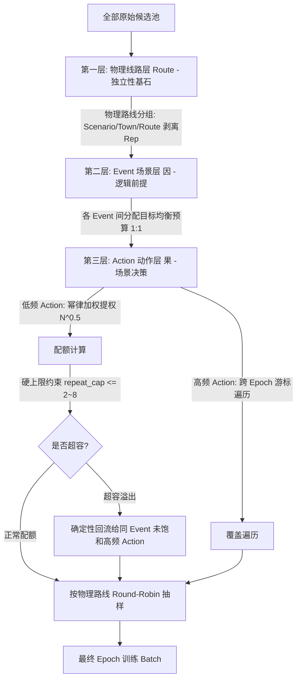

# 层次化因果数据采样方案与实施全案 (线路 -> Event -> Action)

> 2026-09-23 接线修复后的实际合同：Phase3 与 Action 主线/qwen_simple/bev_only 新训默认
> `smooth_cap`，事件内动作开方配额、全局单帧上限8。Action 仍使用 `event_balanced` 模式名，
> 十特殊事件各一份、普通背景两份；显式 `--action-balanced` 是全局动作均衡对照，自动选 `global_action`。
> 不支持把 `--action-balanced` 与 `--sampling-policy smooth_cap` 混用。旧run须原源码，新源码须重建索引/full map、新开run。
>
> Phase3 新增带 SHA256 的 `train_sampling_pool.jsonl`，包含全部 train 正例候选及原索引的 INVALID 池；
> 新训练读取该池，避免构建时已截断高频帧。`frame_index.jsonl` 与验证/测试选择口径保持原样。
> `--max-frames` 仍会显式截断训练池，截断后不承诺覆盖被排除的数据。


**日期**：2026-09-23
**适用范围**：`AutoMoT/qwen3vl_local/sft_new_loop_phase3`、`AutoMoT/qwen3vl_local/action_prior` 及 `AutoMoT/qwen3vl_local/action_expert_ablation`
**核心哲学与排序原则**：
$$\text{线路 (Route)} \longrightarrow \text{Event (因)} \longrightarrow \text{Action (果)}$$
- **线路 (Route)** 是场景与采样的**物理独立性载体**；
- **Event** 优先于 **Action**，因为 **Event 是动作产生的逻辑基础和环境诱因（因）**，**Action 是在特定场景诱因下的决策响应（果）**；
- 杜绝脱离 Event 孤立拉平 Action，也杜绝简单粗暴的 $1:1$ 复制刷爆稀缺动作。

---

## 一、背景痛点与深层数学/物理机制剖析

在端到端与分层具身决策模型（如 Phase3 多模态大模型与 Action Prior 轨迹流匹配模型）训练中，自动驾驶离线数据集具有极强烈的**非正交、二维长尾与时间连续滑窗**特性：

### 1. 简单 1:1 硬均衡的过拟合灾难 (Starvation & Static Overfitting)
- **现象**：某些罕见组合（如特定复杂变道绕障、夜间弱光起步）在特定 Event 下只有极少数帧（例如全数据集仅 4 帧），而高频直道/跟车减速有数千帧。
- **后果**：如果按激进的 $1:1$ 硬性拉平，稀少动作必须被重复采样数十至上百次。大模型拥有海量参数与敏锐的视觉记忆力，会在数个 Batch 内迅速死记硬背下这 4 帧中背景里的固定建筑、特定树木或路灯纹理，导致**虚假因果关联**（模型不是学会了“因前方障碍而变道”，而是学会了“看到这栋红色建筑就变道”），在闭环评测中极易碰撞。

### 2. 高频动作的代表性浪费 (High-frequency Truncation & Low Coverage)
- **现象**：高频动作（如跟车 `DECELERATE`、平稳 `KEEP`）包含了成百上千条真实物理路线，覆盖了暴雨、黄昏、逆光、城镇、乡村等全谱系光影和道路拓扑。
- **后果**：如果为了迁就极小类而粗暴将高频动作截断缩减，绝大多数真实道路素材在整个多 Epoch 训练中**从未被模型见过一次（见课率极低）**，严重损害模型在常规驾驶场景下的基础泛化稳定性与舒适性。

### 3. 因果逻辑倒置 (Causality Inversion)
- **现象**：若脱离 Event 前提直接在全局对 Action 进行均衡，会导致模型学到脱离环境的意图幻觉。
- **机理**：**Event 是因，Action 是果**。无障碍高速公路（Event）天然只应产生极少变道和绝大多数巡航保持；而狭窄施工避障（Event）天然频繁触发减速与借道。采样策略必须保持“在何种 Event 因之下，产生何种 Action 果”的因果概率链条。

---

## 二、三层级设计架构与细致思路



### 1. 第一层：线路层 (Route —— 物理独立性与轮转基石)
- **物理路线去冗余与聚合**：
  同一条物理线路上连续滑窗录制的 10~20 帧，其天气、光照、道路拓扑高度一致。采样前必须严格剥离重复采集标记（`_Rep\d+_`）与采集时间戳（`_\d{2}_\d{2}_\d{2}_\d{2}_\d{2}$`），将样本精确归并为物理路线 `(scenario, route_stem)`。
- **深度优先轮转抽样 (Route-Diverse Round-Robin)**：
  - 优先级永远是：**遍历所有不同物理路线的第 1 帧 $\to$ 各物理路线的第 2 帧 $\to \dots$**；
  - **多样性与 Batch 边界说明**：线路轮转是在**全 Epoch 选样层面**提升物理路线的覆盖多样性，避免长路线连续帧在数据集中占比畸高；在选样完成后，训练常规的全局 shuffle 会打乱这批样本，因此不能假定每个微批次（Batch）内路线都绝对互斥。若后续有特定需求要保证 Batch 内路线硬互斥，应在 Batch 组包阶段单独实现。

### 2. 第二层：Event 层 (因 —— 逻辑因果前置)
- **宏观场景均衡与逻辑定位**：
  - Event（如 UE1~UE7 异常事件、RE2/3/5 特殊规则事件）作为驾驶决策的环境事实与前置诱因。不同 Event 之间按预设目标（如标准 1:1 或带温和权重的业务目标）分配宏观呈现预算 $T_{\text{event}}$；
  - **因果关系与全局动作均衡的科学辩证**：Event 优先于 Action 是以“场景诱发动作”为逻辑出发点；但这是一种有目的的采样架构选择。全局动作均衡也是一种控制输出分布偏置的手段，两者优劣需在相同总预算和验证口径下对照评估，不应简单定性为非黑即白；
  - **容量门限预检**：检查各 Event 下的独立物理路线数 $R_e$ 与帧总数 $N_e$。只有具备充分物理路线支撑的 Event 才能安全承担大预算，避免单一路线假借 Event 之名霸占训练集；
- 确立好当前 Event 的总配额后，向下层 Action 池下发配额任务。

### 3. 第三层：Action 层 (果 —— 场景驱动的决策输出)
在特定 Event 内部，Action 作为响应输出，采用**“温和幂律提权 + 严格重复上限 + 溢出容量回流 + 跨 Epoch 游标遍历”**四位一体细致设计：

#### (1) 温和幂律平滑提权 (Sub-linear Power-law Scaling)
- **训练权重选择本质**：采用亚线性幂律 $W_{e, a} \propto N_{e, a}^\alpha$（推荐 $\alpha = 0.5$）本质上是一种**主动调配训练样本权重的工程选择**，目的是防止稀缺动作被极大池淹没；**它主动重塑了动作在事件内部的相对采样比例，并不等同于保持现实世界的自然条件概率**。
- **数学效果对比**：
  设某 Event 下高频动作有 900 帧，罕见变道有 9 帧：
  - 自然比例：$900 : 9 = 100 : 1$（变道在损失计算中权重极微）；
  - 极端等量：$1 : 1$（变道需要重复 100 次，模型面临严重静态过拟合）；
  - **开方平滑**：$\sqrt{900} : \sqrt{9} = 30 : 3 = 10 : 1$。
  - **结论**：罕见动作的相对呈现比例提升了整整 **10 倍**，既有效抬高了梯度贡献，又不会带来不可承受的单帧重复放大。

#### (2) 严格单帧重复上限 (Hard Repeat Cap)
- 设置全 Epoch 单帧最大允许重复次数 `repeat_cap`（新训默认推荐 2~8）；
- 该 Action 在当前 Event 下的最大安全承载容量为：
  $$\text{Cap}_{e, a} = N_{e, a} \times \text{repeat\_cap}$$
- **容量超限硬约束**：若某 Event 内部所有动作桶的总承载容量 $\sum \text{Cap}_{e, a}$ 小于分配给该 Event 的总预算 $T_{\text{event}}$，**必须立即明确抛出容量不足异常（ValueError），坚决不允许退回整池无限循环而突破 `repeat_cap` 硬上限**。

#### (3) 确定性容量溢出回流 (Deterministic Spillover Redistribution)
- 当低频 Action 按幂律算得的目标配额超过其安全容量 $\text{Cap}_{e, a}$ 时，触发**饱和封顶**；
- 溢出的超额配额（Excess Quotas）**在同一 Event 内部确定性回流给其他尚未饱和的大动作桶（如高频减速、车道保持）**；
- **回流算法**：采用活跃集合迭代，剩余未饱和桶按原始容量的幂律权重继续吸收溢出配额，直至总配额精确补齐至 Event 目标预算 $T_{\text{event}}$。

#### (4) 高频动作：固定主队列与跨 Epoch 游标

同一归属池先按真实帧身份排序，再用固定的 master seed 构建物理路线轮转队列。
队列跨周期保持不变，仅最终训练顺序使用 epoch seed 洗牌。这样任意跨周期的 N 次连续消费
都覆盖 N 个不同帧，长度不超过 N×cap 的片段不会因两个周期的排列碰撞而超限。
每个池在累计获得 N 次呈现后才能保证全覆盖。联合分配在动作回流和本轮不同帧数同样最优时，
优先补偿连续未选轮数，再比较累计呈现数/池内帧数，避免固定同成本解反复饿死某个子池。
若主要约束本身排除了该池，或训练提前结束、显式截断，仍不承诺全覆盖。
若固定人工负例占用的帧容量发生变化，相应剩余容量池也会变化，跨轮覆盖承诺只适用于不变的池。

共享帧按其完整的 event/action 归属集合压缩成一个池，而不是各事件分别维护重复容量。
先联合确定事件与动作的实际分配量，再用该池唯一的游标展开。每个非空池每轮只构建一次排列，
不再为扫描每一帧重建全排列；不存在容量耗尽后继续无界扫描的循环。

Action checkpoint 中的 `sampling_cursor_offsets` 与 `sampling_pool_history` 表示其 `epoch` 的起始位置与历史。
历史保存每个子池的累计 `presentations` 和连续 `skipped_epochs`；两者与游标一致性受到校验。
中途恢复使用该位置重建同一整轮计划，再跳过已提交 micro；只有整轮结束才保存下一轮起点。
Phase3 目前没有 optimizer 断点续训入口；跨轮游标在同一次训练中连续推进，起止位置写入逐轮审计，
不能把保存 LoRA adapter 宣称为可恢复完整训练状态。

## 三、联合分配流程

```python
# quota 使用 N**smooth_power，单个动作容量 N*repeat_cap。
# 事件配额是硬约束；同一事件的动作目标可以因共享帧冲突而回流。
selected, audit = hierarchical_event_action_epoch_sample(
    items_by_event, targets_by_event,
    repeat_cap=8, smooth_power=0.5,
    cursor_state=epoch_start_cursors, master_seed=training_seed,
    pool_history=epoch_start_pool_history,
    rng=random.Random(training_seed + epoch),
)
next_epoch_cursors = audit["next_cursors"]
next_epoch_pool_history = audit["next_pool_history"]
```

图为 `source → event → action → membership pool → sink`，共享池容量只计算一次。
最小费用流的反向边允许把 A 已占的共享帧释放给只有该帧的 B。
目标按顺序为：满足事件预算、尽量不偏离动作目标、最大化本轮不同帧数、改善历史曝光公平性。
费用使用整数分层：公平性总成本差不足以抵消一次额外重复，全部重复与公平性成本差
不足以抵消一次动作目标溢出。未选轮数优先，累计呈现数/池容量的排序作为同等等待的偏好。
容量不足直接报错，不缩轮、不重标 KEEP/UNCOND、不放松 cap。

Phase3 binary 仍由 `balanced_invalid_items` 决定原分层配额与人工题。
人工 same-RS 题保留无重复输入规则并预留实际帧容量；自动负例在相同来源签名、错误 RS 和
原因内与正例联合选择具体帧，保留各分层数量，避免先随机占帧造成假性容量不足。

---

## 四、工程落地代码结构与模块接口

### 1. `AutoMoT/qwen3vl_local/sft_new_loop_phase3/sampling.py`
- **`support_aware_quota`**：
  - 增加 `mode="smooth_cap"`、`smooth_power=0.5` 与 `repeat_cap` 参数；
  - 保持历史 `mode="cycle_even"` 严格兼容旧测试；
  - 核心实现浮点权重计算、饱和桶封顶、溢出回流与小数贪心分配。
- **`route_diverse_cursor_sample`**：
  - 接收 `cursor` 参数；
  - 先按物理线路 `_route_key` 展开为 Round-Robin 序列，再从 `cursor` 处按步长切片提取；
  - 返回采样结果与滚动后的 `next_cursor`。
- **`route_event_action_sample`**：
  - 封装完整的“Route $\to$ Event $\to$ Action”统一因果采样接口；
  - 负责处理 Event 内多 Action 的分配、游标推进以及统计审计信息收集。

### 2. `AutoMoT/qwen3vl_local/action_prior/event_balance.py` & `action_balance.py`
- **`_ordered_route_cycle`**：
  - 扩展接受 `cursor: int = 0`，实现物理路线循环序列的切片偏移；
- **`build_balanced_epoch`**：正式入口统一接收策略、master seed 与起始游标。
- **`build_hierarchical_epoch`**：新默认事件内开方配额，调用 Phase3 联合分配器。
- **`build_action_balanced_epoch`**：显式全局动作对照；同样支持固定种子与游标。
- 训练计划、恢复合同及每轮审计保存实际策略、幂指数、cap、种子、动作目标/实际数量、回流和游标。
- 每轮 `pools` 记录子池容量、本轮/累计呈现数、连续未选轮数和公平成本；
  `pool_history_start` / `next_pool_history` 与起止游标一起用于复现。

### 3. `AutoMoT/qwen3vl_local/sft_new_loop_phase3/test_support_balance.py`
- 包含 `test_hierarchical_route_event_action_sampling` 回归测试：
  - **验证提权与封顶**：4 帧极端稀少变道动作，在总配额 100、`repeat_cap=2` 下被平滑提权并精准封顶在 8 帧以内，未饱和的高频减速动作完整吸收 92 帧；
  - **验证物理线路轮转**：单帧最大重复严格 $\le \text{repeat\_cap}$，且不同路线交叉覆盖；
  - **验证游标推进**：多轮连续调用下游标持续前进，确保大池高频数据全面遍历。

---

## 五、运行建议与审计监控指标

1. **训练启动建议**：
   - 对于 Phase3 SFT 训练与 Action Prior 轨迹流匹配训练，可通过 `--sampling-policy smooth_cap` 显式启用三级因果采样；
   - Phase3：`--sampling-repeat-cap 2 --sampling-smooth-power 0.5`；
   - Action 三入口：`--event-balance-max-frame-repeats 2 --sampling-smooth-power 0.5`；
   - cap=1 才表示单轮每帧不重复，cap=2 允许最多两次。较低上限可能使显式预算不可行。
   - 两者启动脚本均支持 `SAMPLING_POLICY` / `SAMPLING_SMOOTH_POWER`；cap 环境变量分别为
     `SAMPLING_REPEAT_CAP` / `EVENT_BALANCE_MAX_FRAME_REPEATS`，CLI 优先。
2. **评估集严格隔离与基准保留原则**：
   - **验证集/测试集严格不重采样**：`_validation_work` 与 eval 流程必须保持确定性标准口径，**严禁引入训练游标或随机改变验证样本**，保证本次采样修改不引入随训练游标变化的验证集；跨模型仍需核对数据、提示词及合同；
   - **保留 Action 背景 UNCOND 配额**：Action 侧严格保留确认普通背景的 1/6（2/12）配额，不将背景帧掺入特殊事件，也不将未确认帧伪造成合法样本；
   - **保留 Phase3 INVALID 规则**：保持原有的 `balanced_invalid_items` 负例覆盖与诊断评估标准，choice 模式排除非法行，binary 模式维持错位 context 的负例监督。
3. **Epoch 审计监控（Action 写入 `sampling/epoch_*.json`；Phase3 写入 `balance/epoch_*.json` 的 `sampling`）**：
   - **`sampled_actions`**：监控 6 种主要语义动作的呈现分布；
   - **`repeat_histogram`**：检查帧重复次数分布，无任何帧突破 `repeat_cap`；默认8不保证大部分帧少于2次；
   - **Action 的 `unique_routes`、Phase3 的 `train_route_diversity`**：监测物理路线多样性，防止局部单一路线在特定动作上过度主导。


## 完整训练池开训前审计

`audit_rebuilt_index.py` 和 `audit_raw_index.py` 自动发现 manifest 中的训练池，检查
完整 `train_sampling_pool.jsonl` 加原索引 val/test。`run_full_pipeline.sh` 对两者显式传入
`--include-training-pool`，缺少带哈希的训练池即失败，不能回退到旧 train 子集。
管线审计完整产物，即使选择 cycle_even 对照或截断训练也不缩小该检查范围。

RGB 路径存在性按文件去重，原始轨迹按路线读取、signals 按物理帧复用；不同上下文、
错误前提和证据变体仍逐条验证。只有整行完全一致的副本复用验证结果，不按帧去重后丢弃监督。
这仍是文件存在性和机器证据核验，不等同于人工 RGB 复核或图像解码完整性检查。

两份报告的 `input_coverage.sources` 分别记录 training_pool、index_val、index_test 的行数、
独立帧数和语义 case 数，并报告全局独立帧、验证变体和复用副本数量；原 `counts` 等预检计数
仍属于原索引，由 `counts_scope=original_index` 标明。RGB 报告另记各来源路径数量，
raw 报告另记实际回读的帧数、路线数和已核验行数。

## 验证范围

CPU 回归覆盖真实 Phase3 binary/choice 训练选样、共享帧回退、动作容量回流、跨周期 cap=1、
输入倒序不变性、完整候选池读写和篡改拒绝、训练/adapter 元数据，以及三条 Action 真实循环的
首轮/第二轮/轮末中断恢复。小规模穷举核验联合可行性和唯一帧最优值。
合成池性能回放不是生产数据重建；尚未运行真实 Qwen/BEV 或多 GPU 训练，不据此宣称模型效果提升。

此前接线修复结果：898项相关CPU测试通过；2项依赖只读 `mot_lead_offline_runner.py` 的合同测试因本机缺文件受阻，
未绕过校验。10万帧合成Action池回放7轮，每轮95136次；累计覆盖100000帧，实际最多重复2次，
每轮约1.07–1.21秒，进程峰值RSS约661 MiB（含测试fixture及torch导入）。同时核对1/4 rank分片预算，
这不是实际DDP/GPU吞吐测量。Python/Bash语法及diff空白检查通过。

后续公平性/审计修复回归：真实 Action 入口14帧、每轮12次、cap=1的7轮案例，前两轮覆盖全部14帧；
JSON恢复和输入倒序结果一致。新增仅完整池缺图、原始证据冲突、共享帧多上下文、审计来源计数
和三入口历史checkpoint回归。扩大回归907项通过、2项缺只读runner的合同测试排除；
未绕过生产校验，不把合成用例当生产全量验收。
